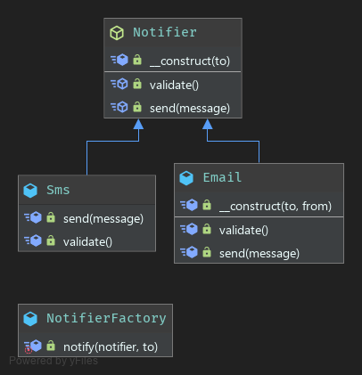

# Simple Factory

- The Simple Factory pattern is the simplest class which has methods for creating other class instances.
- The main idea is if you need to create a tons of instances for some specific class, it’s much easier to use method which returns instances for you.
- Factory helps us to keep all objects creation in one place and avoid of spreading ```new``` key value across codebase.

**Limitations**
- no control of creation process. 
- limited with params you can pass. 

### UML
 